# Bus Ticket Booking System
Bus ticket booking system is a Full-stack web application that allows users to search buses, select seats, booking bus tickets and managing the bookings.  
The application allows role based authorization. bus operators can manage buses and schedules, administrators (admin) can manage creating new operators, routes and manageing them. The backend is built with Django REST Framework and the frontend is built with React.js .

## Screenshots
### Customer Flow
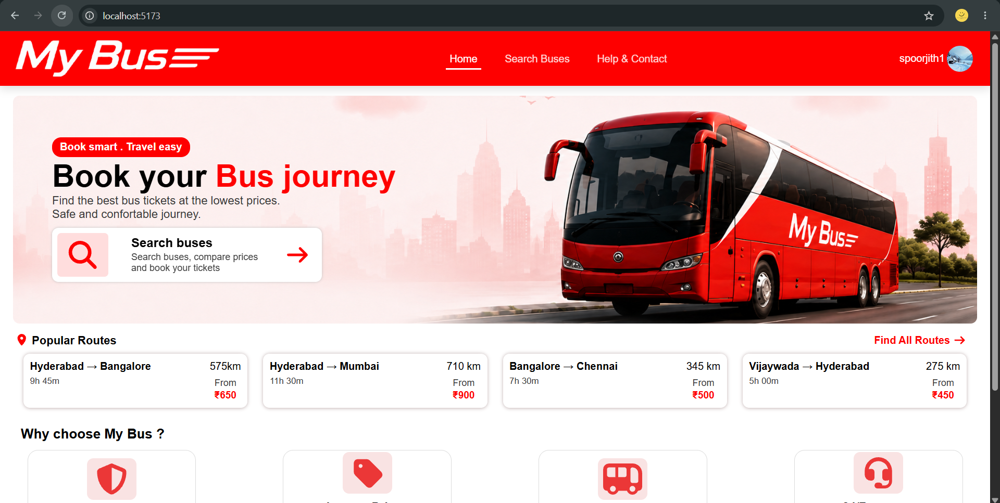
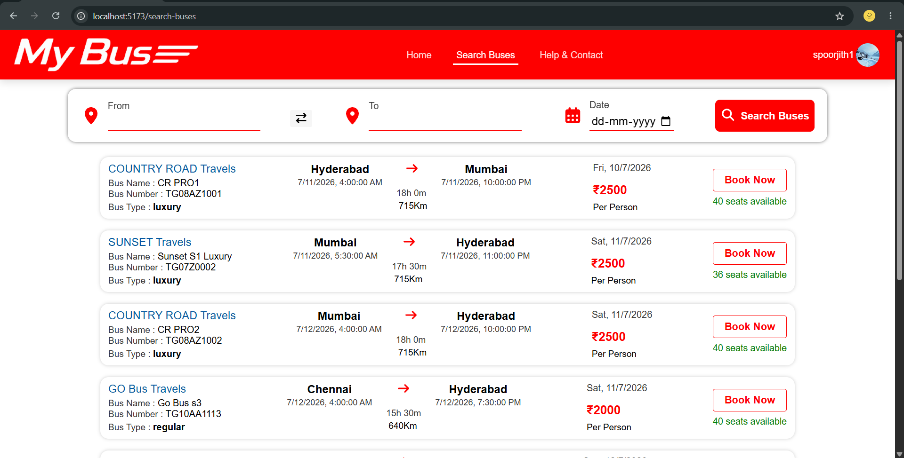
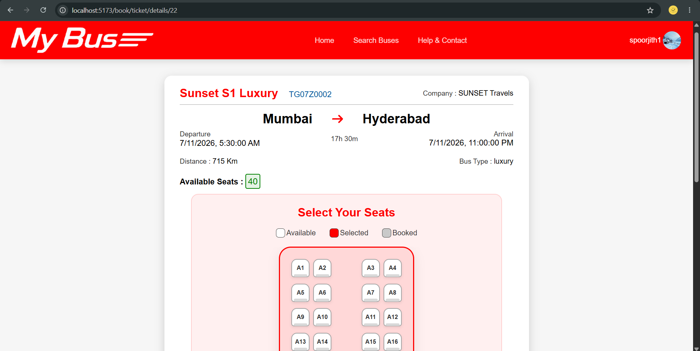
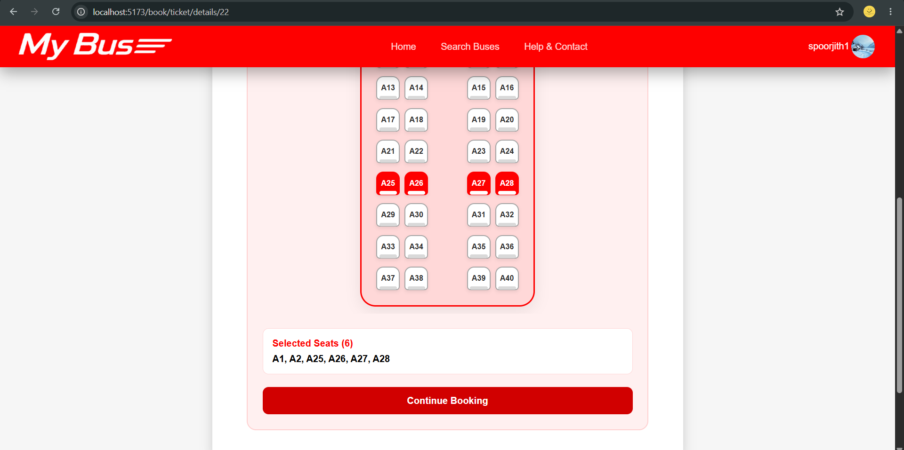
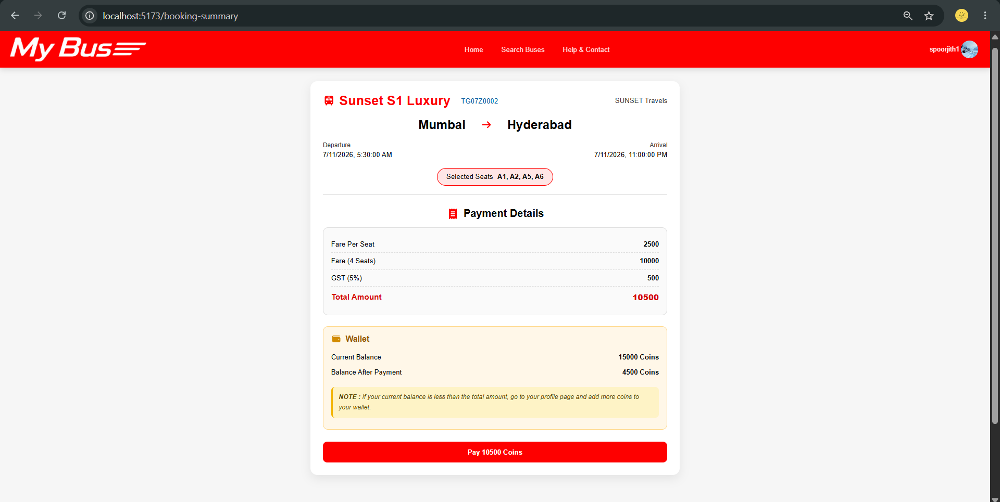
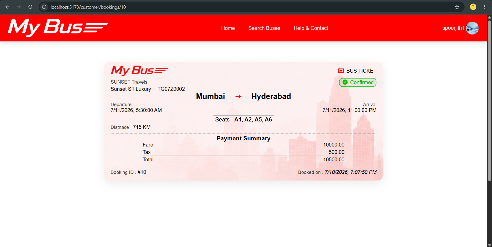
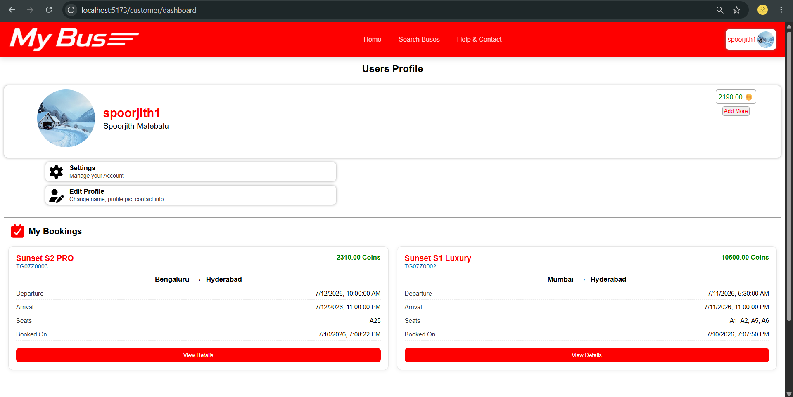

### Operator Dashboard
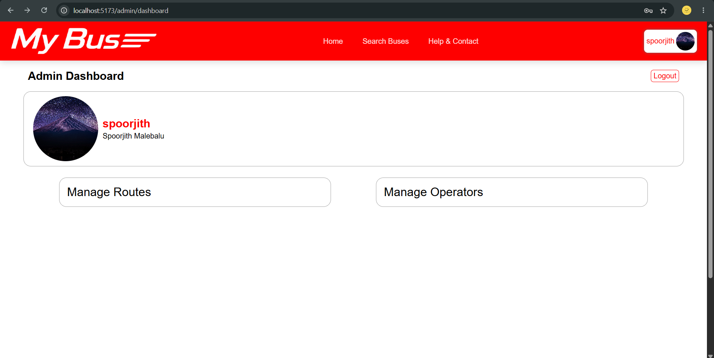
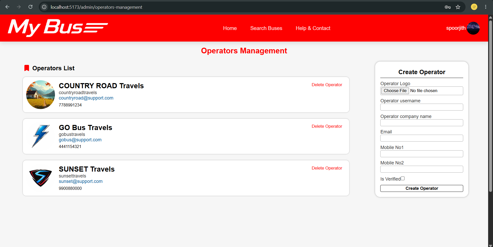
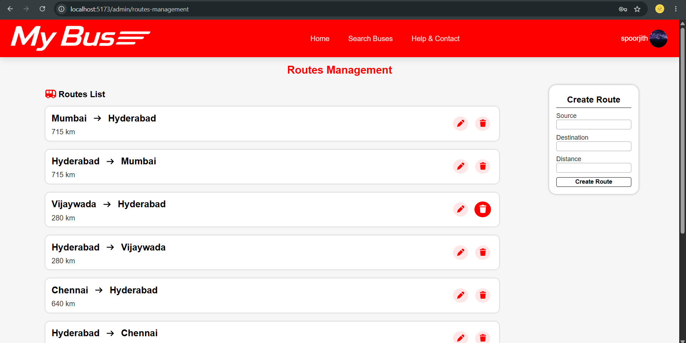

### Admin Dashboard
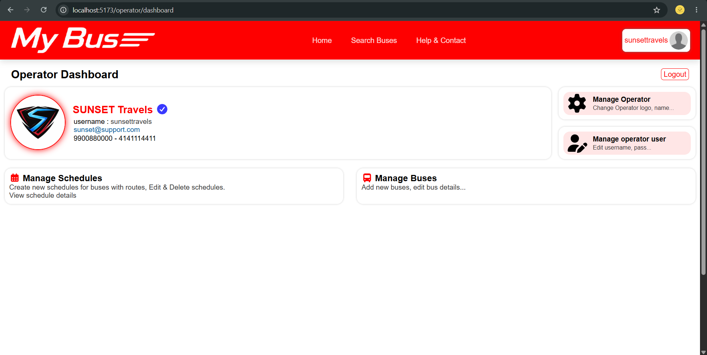
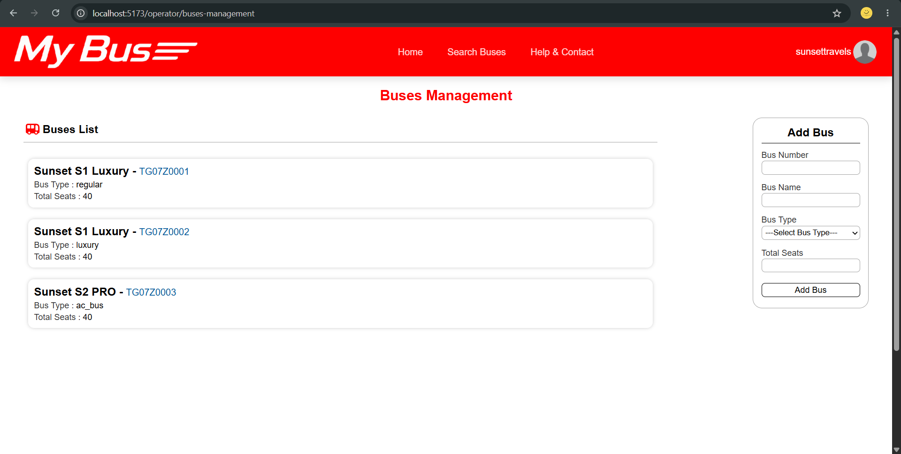
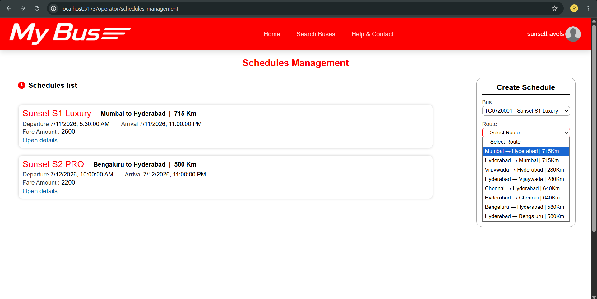

## Features
- user registration & login
- JWT Authentication
- search & filter buses
- seat selection
- customer dashboard
- bus operator dashboard
- admin dashboard
- booking history
- role based operations

## Tech Stack
### Backend
- Python
- Django
- Django REST Framework

### Frontend
- React.js
- Axios
- React Router

### Database
- MySQL

### Athentication
- JWT Authentication

### Tools
- Gits
- Github
- VS Code
- Postman
